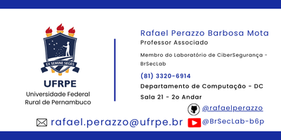
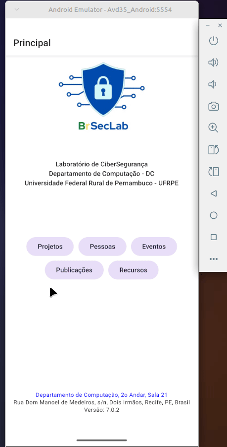

# Rafael Perazzo Barbosa Mota

[Currículo Lattes](http://lattes.cnpq.br/3078288668202994)

Tese de Doutorado

MOTA, Rafael Perazzo Barbosa. Mecanismos para a melhoria do desempenho de sistemas RFID passivos. 2015. Tese (Doutorado em Ciência da Computação) - Instituto de Matemática e Estatística, Universidade de São Paulo, São Paulo, 2015. Disponível em: <http://www.teses.usp.br/teses/disponiveis/45/45134/tde-08122015-093352/>. Acesso em: 2016-04-03.

Dissertação de Mestrado

MOTA, Rafael Perazzo Barbosa. Extensões ao protocolo de comunicação EPCGlobal para tags Classe 1 utilizando autenticação com criptografia de baixo custo para segurança em Identificação por Radiofrequência. 2006. Dissertação (Mestrado em Ciência da Computação) - Departamento de Computação, Universidade Federal de São Carlos, São Carlos-SP, 2006. Disponível em: <http://www.bdtd.ufscar.br/htdocs/tedeSimplificado//tde_busca/arquivo.php?codArquivo=1125/>. Acesso em: 2016-04-03.

---

**Cargo/Profissão:** Docente do Departamento de Computação (DC) da UFRPE  

**Formação acadêmica:** *possui graduação em Ciência da Computação pela Universidade Estadual do Ceará (UECE - 1998-2002), mestrado em Ciência da Computação pela Universidade Federal de São Carlos (UFSCar - 2004-2006) e Doutorado em Ciência da Computação pela Universidade de São Paulo (USP - 2012-2015)*

**Experiência profissional :** *docente da Universidade Federal do Ceará (2007-2013), docente da Universidade Federal do Cariri (2013-2024) e docente da Universidade Federal Rural de Pernambuco (2024-atual)*

**Atualmente:** *Membro do Laboratório de Segurança Cibernética (BrSecLab) do Departamento de Computação da UFRPE*

## Interesses
- Redes
- Segurança Cibernética
- Python
- Javascript
- React
- React Native

## Apps Mobile
- DCApp - <https://github.com/rafaelperazzo/react_salas>
  

<https://play.google.com/store/apps/details?id=com.rafaelperazzo.appdc>

- BrSecLab <https://github.com/rafaelperazzo/brseclab>
  

<https://play.google.com/store/apps/details?id=com.rafaelperazzo.appdc>

## Bibliotecas
- brSecLabCripto <https://github.com/rafaelperazzo/brSecLabCripto>
- brsecLabCriptoJs <https://github.com/rafaelperazzo/brSecLabCriptoJs>
  
